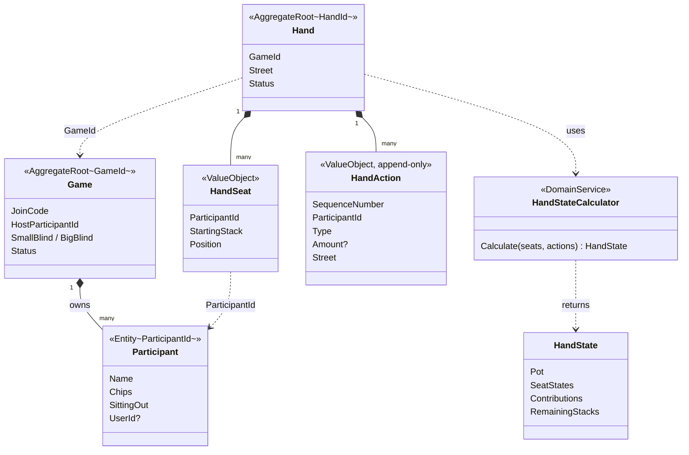
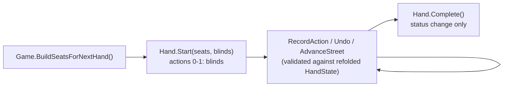

# Gameplay — domain model

## Principles

- **The action log is the single source of truth.** Pot, seat states, and contributions are not
  mutable fields — `HandStateCalculator` computes them as a pure function
  `(seats, actions) → HandState`. Undo = remove the last log entry and recompute from scratch;
  nothing is ever reverted imperatively.
- **Two aggregates.** `Game` (session: roster, blinds, status) and `Hand` (one hand: action log).
  Different change rates, no invariant spans both. `Hand` holds only a `GameId` — no navigation.
- **`Participant.Chips` is durable state**, snapshotted into `HandSeat.StartingStack` when a hand
  starts. The hand then plays entirely on its own log; a full refold of one hand is cheap and
  happens on every validation, unlike a refold of the whole game history.
- **Ids:** own strongly-typed ids (`GameId`, `HandId`, `ParticipantId` — `readonly record struct :
  IStronglyTypedId<T>`, one file each in `ValueObjects/`). `HandSeat`/`HandAction` have no id of
  their own — they are value objects addressed by `ParticipantId` / `SequenceNumber`; their EF
  primary keys are composite.
- **No cards in the model.** Neither hole cards nor community cards are represented yet.

## Aggregate map

Dashed line = reference by id, solid line with diamond = owned by the aggregate.

## Hand lifecycle

No domain or integration events are raised anywhere yet; completing a hand does not touch
`Participant.Chips`.
